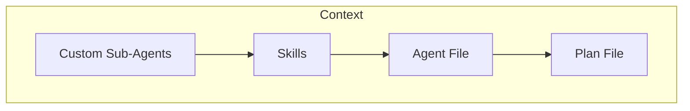

# AI Stuff

> This repository contains various tools, tips and tricks for doing Software Development with AI. 
> 
> Writing code is like writing poetry, it's subjective, interpretive and personal. This repository is meant to be a
> guide; not a rule book. 
>
> I use this stuff in my day-to-day, life if you like something, take it and make it your own. If you don't like it, that's fine too :)
> 
> --Jamie

# Agents

For the purposes of this repository, when I say "agent" I mean an AI Command Line Agent.   
When I say "prompt" I mean typing a mesage to the above AI Agent. 

The following are some popular ones:
* [Claude Code](https://code.claude.com/docs/en/overview)
* [Gemini CLI](https://github.com/google-gemini/gemini-cli)
* [Open Code](https://opencode.ai/)
* [Cline](https://cline.bot/)
* [Aider](https://aider.chat/)

# Security

I'm going to get this out of the way first thing because it's probably the most important thing in this guide. 

When using a an AI Agent or AI model that is run by someone else (not locally run, see my setup for that [here](./LOCAL-SETUP.md)) you have to be mindful of what kind of information you're providing it. 

> [!CAUTION]
> Don't give it secrets, secure information, or other peoples Personally Identifiable Information. This is basically the same kind of rules as you would use for a source control repository (GitHub, Bitbucket, etc). 

Luckily, most of the AI agents make use of an ignore file that works the same as a `.gitignore` file.    

Unforturantely, they all haven't standarized on one yet ... :( 

* [Claude](https://code.claude.com/docs/en/settings)
* [Gemini](https://geminicli.com/docs/cli/gemini-ignore/)
* [Cline](https://docs.cline.bot/customization/clineignore)
* [Open Code](https://opencode.ai/docs/tools/#internals)
* [Aider](https://aider.chat/docs/config/options.html#--aiderignore-aiderignore)

# Context
> [!NOTE]
> **Context** is everything the AI knows during a session. It's the running conversation, any files you've loaded, instructions you've given it, and the history of what's been said. Think of it as the AI's short-term memory, it only knows what's in it, and when the session ends, it's all gone.

When generating code with AI; things go smoother when you start thinking about context, what's in it and how big it is. Not enough context, the agent will start shooting in the dark. Too Much context, the agent will start hallucinating or try to compact it's memory with varying degrees of success. 

Asking AI to complete something for you, with no context, is like asking a Mechanic to give you a set of insructions to replace the brakes on your car, with no other information. 

* What kind of car is it? 
* What kind of brakes do you have?
* What year is the car? 

You can kind of see where things would go wrong with this and you will have to continually go back to the Mechanic. 

This is the same with AI, in order to shortcut that process, you can build / manage the context (memory) of an Agent's session. 

> [!CAUTION]
> It's important to remember that the context is reset with every new session. This can be helpful sometimes but can also be a hinderence. Luckily we have a variety of ways to preload context with content. 

One of the most common ways to persist context across sessions is with different types of Markdown files.

## Customized Sub-Agents
> [!INFO]
> You can think of these as a [persona](https://en.wikipedia.org/wiki/Persona) for when you're working with an AI Agent.

They give the AI an boiler plate and specifics for what you want, so you don't have to type it every time, and
the AI becomes the persona you describe for it. 

> [!TIP]
> The following are two of my agents but you can find a ton of other example agents here:  
> [https://github.com/msitarzewski/agency-agents](https://github.com/msitarzewski/agency-agents)

### My Custom Agents

Architect

[View Agent File](agents/ARCHITECT.md)

Principal Architect persona for high-level planning and system design.
* Stops you from jumping straight into code — forces a diagram or pseudocode first so you catch design mistakes early
* Pushes back on trendy frameworks and unnecessary dependencies before they become your problem
* Useful when starting a new feature, service, or system where the wrong decision upfront costs weeks later
* Keeps security and maintainability as first-class constraints, not afterthoughts

Developer

[View Agent File](agents/DEVELOPER.md)

Senior Developer persona for implementing, debugging, and shipping working code.
* Takes a design (from the Architect or your own head) and produces production-ready, tested code
* Enforces the "no stubs, no placeholders" rule — output must run, not just look plausible
* Useful when you have a clear task and need focused execution without second-guessing the approach
* Pairs with the Architect: Architect designs, Developer builds — keeps each AI interaction scoped to one job

## Skills

> Skills are reusable, filesystem-based resources that provide Claude with domain-specific expertise: workflows, context, and best practices that transform general-purpose agents into specialists. Unlike prompts (conversation-level instructions for one-off tasks), Skills load on-demand and eliminate the need to repeatedly provide the same guidance across multiple conversations.   
> 
> https://platform.claude.com/docs/en/agents-and-tools/agent-skills/overview

Claude pioneered the concept but most all all the Agents today support them. 
* [Claude](https://platform.claude.com/docs/en/agents-and-tools/agent-skills/overview)
* [Gemini](https://geminicli.com/docs/cli/skills/)
* [Open Code](https://opencode.ai/docs/skills/)

> [!TIP]
> Skills I use:
> [skills](./skills)
>
> Ton of other skills:
[https://github.com/VoltAgent/awesome-agent-skills](https://github.com/VoltAgent/awesome-agent-skills)

### Example Skill

Java Unit Tests

[View Skill File](skills/java-unit-tests/SKILL.md)

Writes unit tests for Java code using JUnit 5 and Mockito. Invoke with `/java-unit-tests`.
* Enforces Arrange / Act / Assert structure with consistent test naming conventions
* Covers happy path, edge cases, and failure scenarios in a defined order
* Mocks all external dependencies with Mockito — never the class under test
* Uses AssertJ for readable assertions — no empty or incomplete tests allowed

## Agent File
> [!NOTE]
> One file. Loaded before every conversation. That’s all it takes to turn a stateless AI coding assistant into something that actually remembers how your project works.
> 
> https://medium.com/data-science-collective/the-complete-guide-to-ai-agent-memory-files-claude-md-agents-md-and-beyond-49ea0df5c5a9

So we have Agents that act as a persona, we have Skills that can be executed. Now we want to give the agent some pre-defined context about the respository.

This is where an `AGENT.md` file comes in.

More so than the other two file type based context, find a balancing of too much / too little information in this file can be tricky. 

Have just enough information to jump start the Agent with how your project is structured and things that might not be obvious but don't provide too much as it will start to pollute your context. 

**Some Examples**   
The following notes are examples of things that might be good to have in the `AGENT.md` file. 

> The `scripts/2.0/` folder should be used for any new scripts, the scripts in the root of that folder should be consider depreated. 

> This project has two testing frameworks installed, ignore the tests that use the Mocha Framework.

## Plan File
> [!NOTE]
> A plan file is a written document you create, with the AI's help, before any significant code is generated. It can be called `PLAN.md`, `SPEC.md`, `FEATURE.md`, or anything else that makes sense for your project. The name doesn't matter; the habit does.

Think of it as a contract between you and the AI. Before you say "build this," you say "here's what we're building, and here's why." This is especially important for large features or new applications where a bad early assumption can cost you hours of backtracking.

**Why bother?**
* AI has no memory between sessions, a plan file gives a fresh session everything it needs to pick up where you left off
* The fewer clear directives you give, the further off the rails the AI can go; a plan keeps it scoped
* Writing the plan forces *you* to think through the problem before the AI starts making decisions for you

**What goes in one?**
* What you're building and why
* Technology choices and the rationale behind them (so the AI doesn't second-guess them)
* High-level component breakdown or data model
* Acceptance criteria, how you'll know it's done
* For multi-session work: what phase is this, and what was already completed

> [!TIP]
> Store plan files in a `/designs` directory in your repo so they're version controlled and reviewable. Treat them as living documents, update them when decisions change.

> [!NOTE]
> The plan is done when a developer could implement it without making a single assumption.

# Process

Depening on type type / scale of work you want to do with an agent, determines how much much mangement you should consider doing. 

## Small Stuff

> [!NOTE]
> I think of small stuff as: trying to fix a bug, write a single method or adding some unit tests for a class

These types of request usually don't need planning and can be executed with a few back and forths with the agents. 

> [!TIP]
> Some things to consider:  
> * Give it as much information that you can reasonable think of
> * If you have suspicions or thoughts on how to implement, tell it

## Large Features / Full Application

Keeping our context in mind, the fewer directives you give it, the further off the rails it can go. Further more, if you're going to need multiple chat sessions to complete a goal, you're going to need a way to maintain memory / context inbetween the sessions. 

This can be accomplished 

# References
