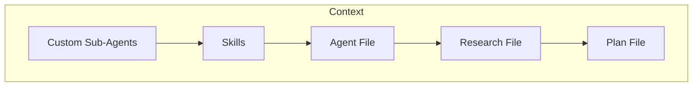

# AI Stuff

> This repository contains various tools, tips and tricks for doing Software Development with AI. 
> 
> Writing code is like writing poetry, it's subjective, interpretive and personal. This repository is meant to be a
> guide; not a rule book. 
>
> I use this stuff in my day-to-day, life if you like something, take it and make it your own. If you don't like it, that's fine too :)
> 
> --Jamie

# Coding Agents

For the purposes of this repository, when I say "Agent" I mean "Coding Agent".   
These are command line apps that you can run to chat back and forth with an LLM (Large Language Model). 

When I say "prompt" I mean typing a message to the above Coding Agent.

The following are some popular ones:
* [Claude Code](https://code.claude.com/docs/en/overview)
* [Gemini CLI](https://github.com/google-gemini/gemini-cli)
* [Open Code](https://opencode.ai/)
* [Cline](https://cline.bot/)
* [Aider](https://aider.chat/)

# Security

I'm going to get this out of the way first thing because it's probably the most important thing in this guide. 

When using a an Agent or AI model that is run by someone else (not locally run, see my setup for that [here](./LOCAL-SETUP.md)) you have to be mindful of what kind of information you're providing it. 

> [!CAUTION]
> Don't give it secrets, secure information, or other peoples Personally Identifiable Information. This is basically the same kind of rules as you would use for a source control repository (GitHub, Bitbucket, etc). 

Luckily, most of the agents make use of an ignore file that works the same as a `.gitignore` file.    

Unfortunately, they all haven't standardized on one yet ... :(

* [Claude](https://code.claude.com/docs/en/settings)
* [Gemini](https://geminicli.com/docs/cli/gemini-ignore/)
* [Cline](https://docs.cline.bot/customization/clineignore)
* [Open Code](https://opencode.ai/docs/tools/#internals)
* [Aider](https://aider.chat/docs/config/options.html#--aiderignore-aiderignore)

# Context
> [!NOTE]
> **Context** is everything the AI knows during a session. It's the running conversation, any files you've loaded, instructions you've given it, and the history of what's been said.

When generating code with AI; things go smoother when you start thinking about context, what's in it and how big it is. Not enough context, the agent will start shooting in the dark. Too Much context, the agent will start hallucinating or try to compact it's memory with varying degrees of success. 

Asking AI to complete something for you, with no context, is like asking a Mechanic to give you a set of instructions to replace the brakes on your car, with no other information.

* What kind of car is it? 
* What kind of brakes do you have?
* What year is the car? 

You can kind of see where things would go wrong with this and you will have to continually go back to the Mechanic. 

This is the same with AI, in order to shortcut that process, you can build / manage the context (memory) of an Agent's session. 

> [!CAUTION]
> It's important to remember that the context is reset with every new session. This can be helpful sometimes but can also be a hinderence. Luckily we have a variety of ways to preload context with content. 

One of the most common ways to persist context across sessions is with different types of Markdown files.

## Customized Sub-Agents
> [!INFO]
> You can think of these as a [persona](https://en.wikipedia.org/wiki/Persona) for when you're working with an Agent.

They give the AI a boilerplate and specifics for what you want, so you don't have to type it every time, and
the AI becomes the persona you describe for it. 

> [!TIP]
> The following are two of my agents but you can find a ton of other example agents here:  
> [https://github.com/msitarzewski/agency-agents](https://github.com/msitarzewski/agency-agents)

#### Architect Custom Agent

Expand

[View Agent File](agents/ARCHITECT.md)

Principal Architect persona for high-level planning and system design.
* Stops you from jumping straight into code — forces a diagram or pseudocode first so you catch design mistakes early
* Pushes back on trendy frameworks and unnecessary dependencies before they become your problem
* Useful when starting a new feature, service, or system where the wrong decision upfront costs weeks later
* Keeps security and maintainability as first-class constraints, not afterthoughts

#### Developer Custom Agent

Expand

[View Agent File](agents/DEVELOPER.md)

Senior Developer persona for implementing, debugging, shipping working code, and deep codebase research.
* Takes a design (from the Architect or your own head) and produces production-ready, tested code
* Enforces the "no stubs, no placeholders" rule — output must run, not just look plausible
* Useful when you have a clear task and need focused execution without second-guessing the approach
* Pairs with the Architect: Architect designs, Developer builds — keeps each AI interaction scoped to one job
* Switches into read-only research mode on request — traces data and control flow end-to-end, surfaces hidden dependencies, and writes findings to a file rather than jumping straight to code

## Skills

> Skills are reusable, filesystem-based resources that provide Claude with domain-specific expertise: workflows, context, and best practices that transform general-purpose agents into specialists. Unlike prompts (conversation-level instructions for one-off tasks), Skills load on-demand and eliminate the need to repeatedly provide the same guidance across multiple conversations.   
> 
> https://platform.claude.com/docs/en/agents-and-tools/agent-skills/overview

Claude pioneered the concept but most all the Agents today support them.
* [Claude](https://platform.claude.com/docs/en/agents-and-tools/agent-skills/overview)
* [Gemini](https://geminicli.com/docs/cli/skills/)
* [Open Code](https://opencode.ai/docs/skills/)

> [!TIP]
> Skills I use:
> [skills](./skills)
>
> Ton of other skills:
[https://github.com/VoltAgent/awesome-agent-skills](https://github.com/VoltAgent/awesome-agent-skills)

### Example Skill

Java Unit Tests

[View Skill File](skills/java-unit-tests/SKILL.md)

Writes unit tests for Java code using JUnit 5 and Mockito. Invoke with `/java-unit-tests`.
* Enforces Arrange / Act / Assert structure with consistent test naming conventions
* Covers happy path, edge cases, and failure scenarios in a defined order
* Mocks all external dependencies with Mockito — never the class under test
* Uses AssertJ for readable assertions — no empty or incomplete tests allowed

## Agent File
> [!NOTE]
> One file. Loaded before every conversation. That’s all it takes to turn a stateless AI coding assistant into something that actually remembers how your project works.
> 
> https://medium.com/data-science-collective/the-complete-guide-to-ai-agent-memory-files-claude-md-agents-md-and-beyond-49ea0df5c5a9

So we have Agents that act as a persona, we have Skills that can be executed. Now we want to give the Agent some pre-defined context about the respository.

This is where an `AGENT.md` file comes in.

More so than the other file types, finding the right balance of too much / too little information in this file can be tricky.

Have just enough information to jump start the Agent with the architecture of your project and things that might not be obvious but don't provide too much as it will start to pollute your context. 

**Some Examples**   
The following notes are examples of things that might be good to have in the `AGENT.md` file. 

> The `scripts/2.0/` folder should be used for any new scripts, the scripts in the root of that folder should be consider depreated. 

> This project has two testing frameworks installed, ignore the tests that use the Mocha Framework.

## Research File
> [!NOTE]
> A research file is a document the AI writes for you, before any planning or code generation, that captures what it found in your codebase. It can be called `RESEARCH.md`, `FINDINGS.md`, or anything that makes sense. The name doesn't matter; doing it before planning does.

Think of it as a sanity check before the AI starts making decisions. Before you say "plan this," you say "show me what you know." This is especially important when the AI is working in an unfamiliar part of the codebase where a wrong assumption early on can send the whole plan in the wrong direction.

**Why bother?**
* It forces the AI to actually read the code rather than guess at how it works
* You get to catch misunderstandings before they're baked into a plan
* Correcting a markdown file is a lot cheaper than untangling bad code

**What goes in one?**
* How the relevant code is structured and why
* Key decisions or patterns already in place
* Anything non-obvious that would trip up someone unfamiliar with the codebase
* Dependencies and anything else that could be affected by changes

> [!TIP]
> When prompting, use words like "deeply", "in great detail", and "intricacies", it discourages surface-level skimming and gets you more useful output.

> [!NOTE]
> The research is done when you've read it and are confident the AI understands the system well enough to plan against it.

## Plan File
> [!NOTE]
> A plan file is a written document you create, with the AI's help, before any significant code is generated. It can be called `PLAN.md`, `SPEC.md`, `FEATURE.md`, or anything else that makes sense for your project. The name doesn't matter; the habit does.

Think of it as a contract between you and the AI. Before you say "build this," you say "here's what we're building, and here's why." This is especially important for large features or new applications where a bad early assumption can cost you hours of backtracking.

**Why bother?**
* AI has no memory between sessions, a plan file gives a fresh session everything it needs to pick up where you left off
* The fewer clear directives you give, the further off the rails the AI can go; a plan keeps it scoped
* Writing the plan forces *you* to think through the problem before the AI starts making decisions for you

**What goes in one?**
* What you're building and why
* Technology choices and the rationale behind them (so the AI doesn't second-guess them)
* High-level component breakdown or data model
* Acceptance criteria, how you'll know it's done
* For multi-session work: what phase is this, and what was already completed

> [!TIP]
> Store plan files in a `/designs` directory in your repo so they're version controlled and reviewable. Treat them as living documents, update them when decisions change.

> [!NOTE]
> The plan is done when a developer could implement it without making a single assumption.

# Process

Depending on the type / scale of work you want to do with an agent determines how much management you should consider doing.

* Smaller Stuff: Autocomplete, trying to fix a bug, writing a single method or adding unit tests to a class
* Bigger Stuff: Designing and implementing a new application

> [!TIP]
> Some things to remember:   
> * Have your Agent do a version control commit after each change (helps if you need to walk back changes)
> * The Larger the project, the more planning you need to do 
> * Lean on using a plan file, especially if there is even a remote change you're going to need multiple sessions to finish a request

## Create / Update AGENTS.md

We will use the `AGENTS.md` to contain the architecture of the repository. Documentation drift is a real thing and we can use this an opportunity to ensure this file up-to-date. 

You can use the [Update Agent File](./skills/update-agent-file/SKILL.md) to help ASSIST with this. 

> [!CAUTION]
> Make sure you review anything added to this document, continously, to ensure it remains correct. 

## Smaller Tasks

These types of request usually don't need planning and can be executed with a few back and forths with the agents. 

> [!TIP]
> Some things to consider:  
> * Give it as much information that you can reasonable think of
> * If you have suspicions or thoughts on how to implement, tell it

## Bigger Tasks / Projects

Keeping our context in mind, the fewer directives you give it, the further off the rails it can go. Further more, if you're going to need multiple chat sessions to complete a goal, you're going to need a way to maintain memory / context inbetween the sessions.

Whether you're building something from scratch or adding a big feature to an existing project, having a deliberate process makes a huge difference, better output from the Agent, and you stay in control of where things are going.

### Phase 0: Setup

Create a `designs/` folder at the root of the repository. This folder will contain all documents used to collaborate with AI, except `AGENTS.md` which lives at the repository root.

The name isn't important, `plans`, `specs`, whatever makes sense for you and your team.

> [!NOTE]
> If you're working on an existing codebase, some of this may already be in place, skip or adapt as needed.

Then create a sub-folder inside it for what you're working on.

The following are some examples:
* `/designs/initial/` - Initial Development for a brand new Application
* `/designs/new-cool-feature/` - Implementation of a cool new feature

> [!TIP]
> If you're using a ticketing system for work (Jira, Trello, etc), you can name the folder based on the ticket or the epic you're working on:    
> `/designs/ABC-123-New-Feature/`

### Phase 1: Research

> [!NOTE]
> This is only necessary on an existing code base

Create a [Research File](#research-file) in the sub-folder created in the first step.

For Example:    
* `/designs/initial/RESEARCH.md`
* `/designs/new-cool-feature/RESEARCH.md`

Using the [DEVELOPER](#developer-custom-agent) custom agent, prompt the Agent to thoroughly research the code base or the parts of the code base you plan to modify. 

Continue working with the Agent and iterating until you're confident that it has an understanding of the researched areas and there aren't any issues. 

### Phase 2: Planning

Create a [Plan File](#plan-file) in the sub-folder created in the first step.

For Example:
* `/designs/initial/PLAN.md`
* `/designs/new-cool-feature/PLAN.md`

Using the [ARCHITECT](#architect-custom-agent) custom agent, prompt the Agent to create a detailed plan for what you want to build or change.
If you created a Research File, reference it so the Agent can build on what it already knows about the codebase.
This should be a back and forth conversation with the Agent, where it produces something, you review it and then you prompt it again. 

> [!TIP]
> I really like the "Annotation Cycle" Boris Tane uses here: https://boristane.com/blog/how-i-use-claude-code/#the-annotation-cycle

Once you have a draft, ask the Agent to review it, not to implement it, just to poke holes in it.
Ask it to flag gaps, ambiguities, overlooked details, or anything that would trip up someone trying to implement it.
These are the kinds of assumptions that don't show up until the code is already wrong.

**Some Example Prompts:**
* "What's missing?"
* "What types of security vulnerabilities can this introduce?"
* "Are there ways we can improve the maintainability of this?"
* "If you were a developer tasked with building this, what questions would you still have?"
* "What assumptions are we making that aren't written down?"
* "Try to poke holes in this plan. What could go wrong or what have we overlooked?"

Continue iterating until you're confident the plan is solid and any assumptions made will be minimal.

#### Spin Off Detailed Sub-Documents

For complex areas of the plan, it can help to break them out into their own focused documents rather than cramming everything into one file.   
Things like a data model, API contract, or auth flow are often detailed enough to warrant their own file.

For Example:
* `/designs/new-cool-feature/PLAN-DATA-MODEL.md`
* `/designs/new-cool-feature/PLAN-API.md`

Keep the main plan file as the source of truth and reference the sub-documents from it. This keeps context manageable, you can load just what's relevant for a given session rather than the whole thing.

> [!TIP]
> Same as a traditional Software Development Life Cycle (SDLC), more time spent on this step will result in less time spent in subsequent steps.

### Phase 3: Development Preparation

Before writing any code, consider breaking it into phases.
Each phase should be small enough to fit comfortably in a single session, planning documents, relevant code, and conversation history all included.

> [!CAUTION]
> LLMs have a finite context window. When it fills up, the model starts compacting its memory and can lose important details mid-implementation.
Phases that are too large are the most common reason things go off the rails late in a session.

A good phase has three qualities:
* **Self-contained** — it has a clear start, end, and defined output. You should be able to describe what "done" looks like before you start.
* **Right-sized** — the plan section, relevant files, and conversation history for that phase should all fit in context without compaction.
* **Sequenced** — it builds on what came before and sets up what comes next.

Write the phases into your plan file before starting. Use the [ARCHITECT](#architect-custom-agent) agent to help break it down if needed.

> [!NOTE]
> If you use multiple sessions, make sure to instruct the Agent to read the Plan / Research files before executing a phase. 

### Phase 4: Development

We've done a lot of work to get here, now it's time for the implementation. 

Since we've done all of the preparation work, this phase becomes a simple cycle, using the [DEVELOPER](#developer-custom-agent) agent:
* Have the Agent Execute a phase of development
* **Read the Source Code Generated**
* Request any necessary changes
* Have the Agent Execute a code review
* **Read the Source Code Generated**
* Rinse and repeat for the rest of your phases

I strongly, strongly recommend, either doing it manually or having the Agent Commit frequently. This makes it so much easier to walk back changes and resolve issues. 

> [!TIP]
> You can use Skills to standardize your code reviews, see: [Code Review Java](skills/code-review-java/SKILL.md) and [Code Review Node](skills/code-review-node/SKILL.md)

# Closing

In closing, take as much or as little of this plan as makes sense for you but I will strongly suggest making use of the plan / research files.    
The community is really honing in on this being the best approach right now.

This document was created using the following guides as a road map:
* https://github.com/thetechdjinn/ai-assisted-development
* https://boristane.com/blog/how-i-use-claude-code/

I really liked the ending to Boris Tane's post:

> The Workflow in One Sentence    
> Read deeply, write a plan, annotate the plan until it’s right, then let Claude execute the whole thing without stopping, checking types along the way.   
> That’s it. No magic prompts, no elaborate system instructions, no clever hacks. Just a disciplined pipeline that separates thinking from typing. The research prevents Claude from making ignorant changes. The plan prevents it from making wrong changes. The annotation cycle injects my judgement. And the implementation command lets it run without interruption once every decision has been made.
